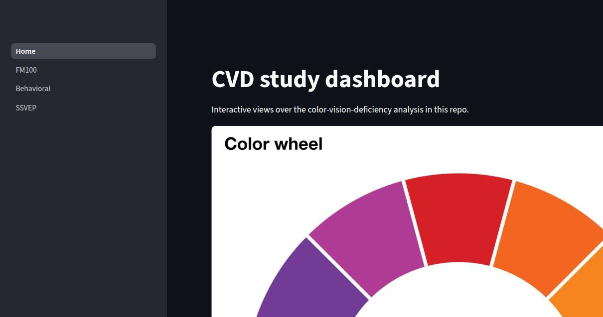
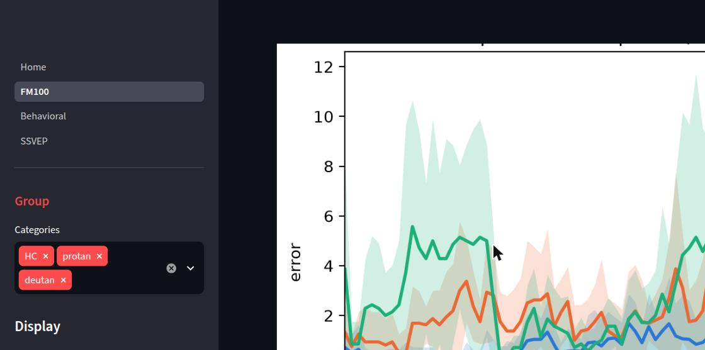
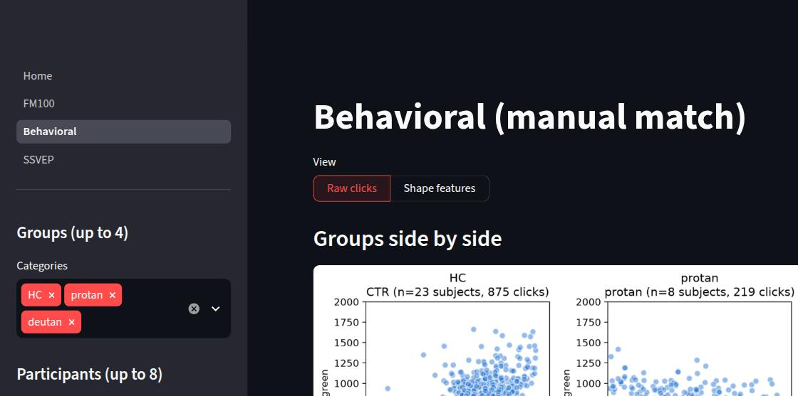
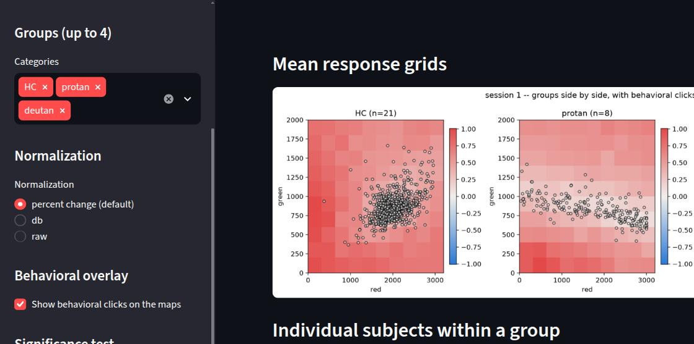

# met_dashboard

Interactive Streamlit dashboard presenting pre-computed FM100/behavioral/SSVEP
analysis results for the MET colorblindness study. Standalone export of the
dashboard from the private `DataAnalysis` research repo -- no data included,
no notebooks, just the presentation layer and the analysis code it calls.

## Quickstart

1. Install `git` and [`uv`](https://docs.astral.sh/uv/getting-started/installation/).
2. Clone this repo and `cd` into it.
3. `uv sync` -- creates a virtual environment and installs dependencies (uv
   fetches a matching Python version automatically if needed).
4. Place the data files you were given into `data/` (see Data below).
5. `uv run streamlit run dashboard/Home.py` -- opens at `http://localhost:8501`.

## Screenshots

**Home** -- landing page with a color-wheel reference for the FM100 cap colors.



**FM100** -- per-group error profiles (mean +-1 SD band), radial or linear, with
per-participant overlays and pairwise significance.



**Behavioral** -- raw manual-match clicks by group or participant, plus a
shape-feature space (PCA line orientation) that separates protan/deutan.



**SSVEP** -- mean EEG response grids by group or participant, with an optional
behavioral-click overlay and cluster-permutation significance.



## Data

No data is committed to this repo -- only the folder structure. Place the
files you were given into the matching spot under `data/`:

```
data/
  standardizedScores/repeatedSessionsPY.txt
  manualTest/behavioral_table.csv
  ssveps/files/
    metadata.csv
    runmap.csv
    baselines.csv
    subject_troughs.csv
    group_troughs.csv
    grid.json
```

To keep data somewhere else instead, set `MET_DASHBOARD_DATA_DIR` to that
path before running the dashboard.

## Tests

Each vendored project has its own test suite:

```
uv run pytest standardizedScores/FM100/tests beh/tests ssveps/tests ssvepBeh/tests -q
```

Most tests need real data in place (see Data above) to pass -- without it,
they fail on a clear `FileNotFoundError` naming the missing file, not a
code error.

## Layout

- `dashboard/` -- the Streamlit app (`Home.py` + `pages/`).
- `beh/`, `ssveps/`, `standardizedScores/FM100/`, `ssvepBeh/` -- the analysis
  code the dashboard calls into (`scripts/` + `tests/` each), vendored from
  the source repo.
- `assets/screenshots/` -- the images used in this README.
